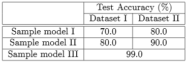

# Like fancy table?
Do it with LaTeX. Code can be found [here](https://github.com/Sins-Repo/FancyTable/blob/main/table.tex)

 

# Sample output
### Table 1
Begin with a simple one  

 

### Table 2

 

### Table 3

 

### Table 4

